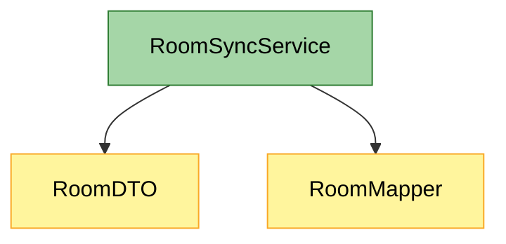
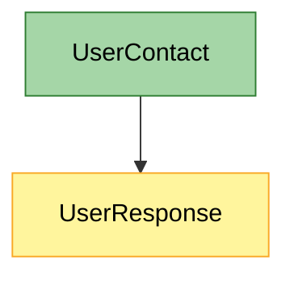

# archdiff

`archdiff` is a tiny local utility that turns the Python changes in your current Git branch into a Mermaid architecture-diff graph.

It is intentionally simple: it does not try to understand your whole application. Instead, it answers a narrower question:

> Which Python entities appeared or changed in this branch, and what other entities do they reference?

## Usage

```bash
python archdiff.py > architecture.md
```

By default, `archdiff` tries `main`, `origin/main`, `master`, and `origin/master`. You can also pass an explicit base ref:

```bash
python archdiff.py master
python archdiff.py origin/master
python archdiff.py main
```

If you pass `main` in a repository that only has `master`, `archdiff` falls back to `master` automatically.

`archdiff` decodes `git` output as UTF-8 with replacement for invalid bytes, so it should keep working on Windows consoles that use a non-UTF-8 code page.

### Large graphs

Some Mermaid renderers refuse to render diagrams with 500 or more edges. To keep the generated Markdown previewable by default, `archdiff` renders at most 450 edges and adds a note when extra edges are omitted.

You can choose a different limit:

```bash
python archdiff.py --max-edges 200 > architecture.md
```

Or render every edge if your own Mermaid viewer initializes Mermaid with a higher `maxEdges` value:

```bash
python archdiff.py --max-edges 0 > architecture.md
```


The output is Markdown containing a Mermaid diagram:



## Visualizing the graph

The generated `architecture.md` file is already the visualization source. Open it in any Markdown viewer that supports Mermaid.

Good quick options:

1. **GitHub or GitLab** - commit or upload `architecture.md`, then open the file in the web UI. Mermaid code blocks render automatically.
2. **VS Code / Cursor** - open `architecture.md` and run `Markdown: Open Preview` from the command palette. If your editor does not render Mermaid by default, install a Mermaid Markdown preview extension.
3. **Mermaid Live Editor** - open <https://mermaid.live>, copy only the contents inside the generated ```mermaid block, and paste it into the editor.

For your example, copy this part into Mermaid Live Editor if your Markdown viewer does not render Mermaid:



Color meaning:

- Green nodes are entities added or changed in the current branch.
- Yellow nodes are referenced context entities.

## MVP behavior

1. Runs `git diff --name-only <base>...HEAD`.
2. Keeps changed `*.py` files.
3. Detects newly added class and function names from the diff.
4. Parses changed files with Python `ast`.
5. Collects likely references from names, calls, and attributes.
6. Renders a Mermaid graph and a short entity list.

If no newly added classes or functions are found in the diff, `archdiff` falls back to all top-level classes and functions in changed Python files.

## License

MIT.